<h1>Clone Repository</h1>
For cloning repository

```Bash
git clone 
```
<h1>Build Images</h1>

**webserver/Dockerfile**
```Bash
cd webserver
docker build . -t {yourimage_name}:{tag} 
cd ../mysql
docker build . -t {yourimage_name}:{tag} 
```
<h1>Run Images</h1>

```Bash
docker run -n {container_name} -p 80:80 {yourimage_name}:{tag} 
docker run --name some-mysql -p 3306:3306 -e MYSQL_ROOT_PASSWORD=my-secret-pw -e MYSQL_DATABASE=user_auth -d {yourimage_name}:{tag}

```


<h1>OBS Image upload</h1>

Upload an image under an bucket named test.jpg then from Object Acl Settings activate public read and write


<h1>Create CCE </h1>

<h2>spesifications </h2>

- **CLUSTER TYPE:**  CCE Standard Cluster
- **Billing Mode:** pay-per-use
- **Cluster Version:** v1.29
- **Cluster Scale:** Node50
- **Master Nodes:** Single
- **VPC:** basic default VPC
- **Default Node Security Group:** Auto Generate
- **Network Model** Tunnel Network
- **Container CIDR Block:** Auto Select
  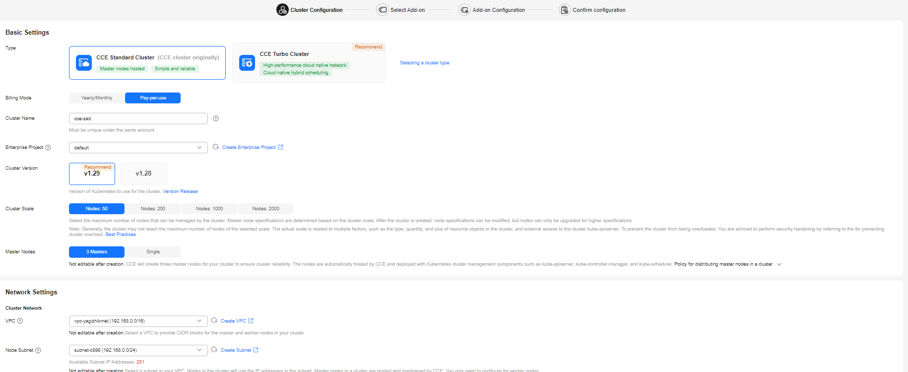

  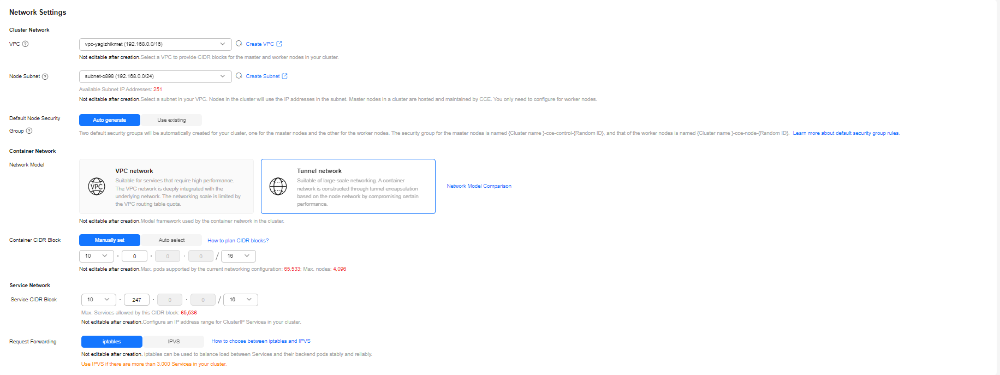

<h2> Add-On </h2>

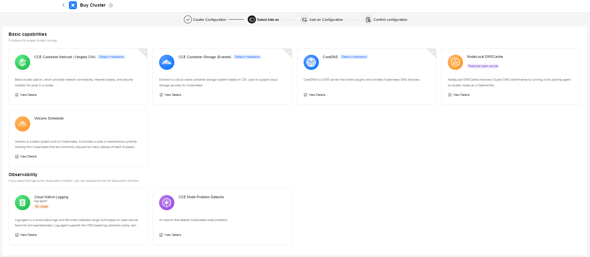

**De-select all add-ons**

<h1>3. Create a Node </h1>

- Under the Nodes Tab Go to your Nodes and Click create Node
  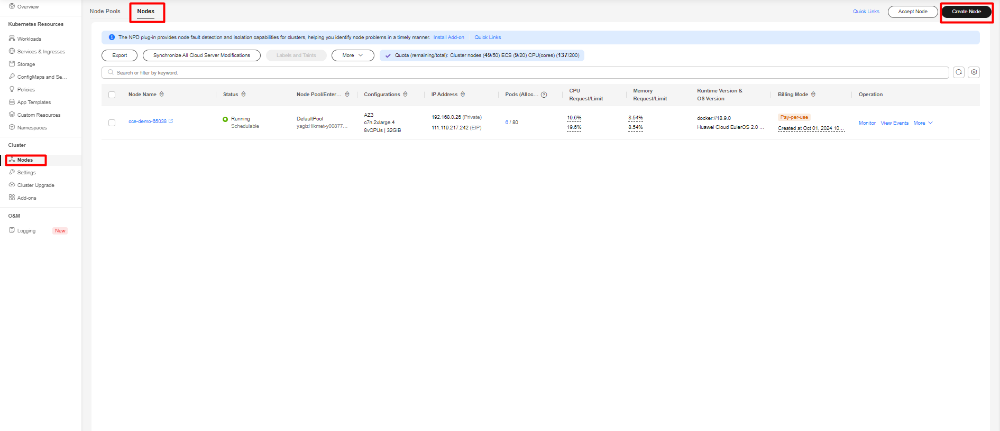
- specification 
  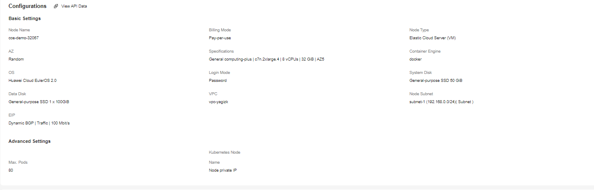
- **Billing Mode** Pay-per-useNode 
- **Type** Elastic Cloud Server (VM)
- **Specifications** General computing-plus | c7n.2xlarge.4 | 8 vCPUs | 32 GB | 
- **Container** Engine docker 
- **OS** Huawei Cloud EulerOS 2.0
- **EIP** Auto Create Dynamic BGP | Traffic | 100 Mbit/s

<h1>3. Create StatefulSet Mysql-server Workload </h1>

- From Workloads go to StatefulSets and click Create Workload
  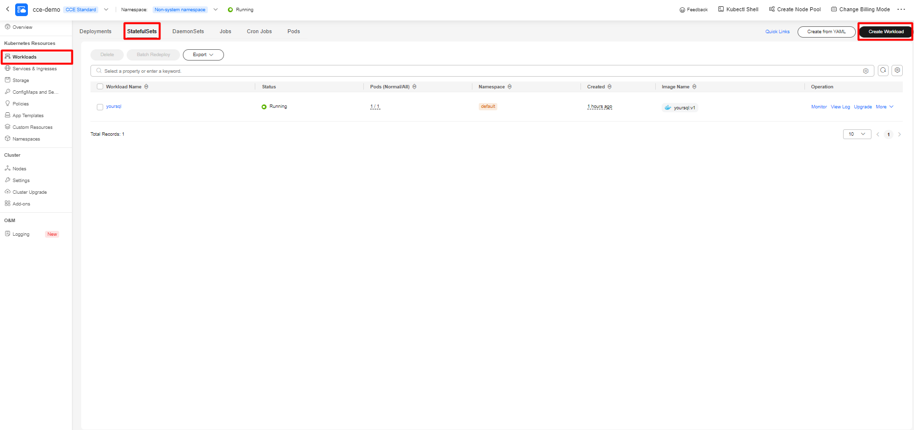
- choose pod number and be sure it is StatefulSet
- select your  images/image and version
  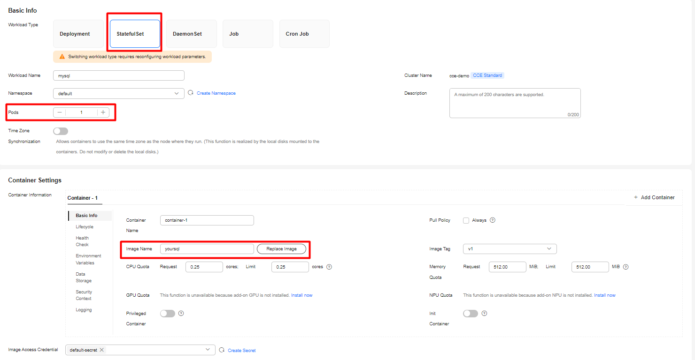
- Add the folowing environmental variables
  - MYSQL_ROOT_PASSWORD	my-secret-pw
  - MYSQL_DATABASE	user_auth
  - MYSQL_USER	db_user
  - MYSQL_PASSWORD	my-secret-pw
    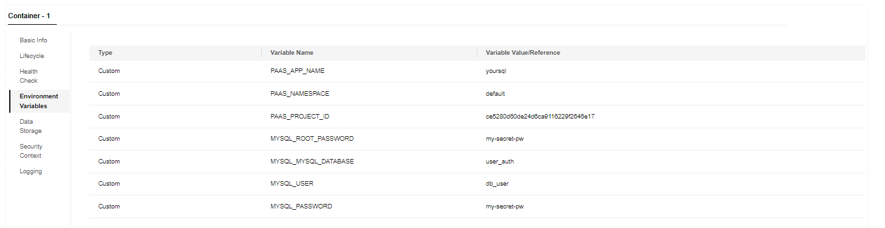
- Set the Headless Service Parameters as **mysql** as service name and Port Name and 3306 as Service Port and Container Port 
  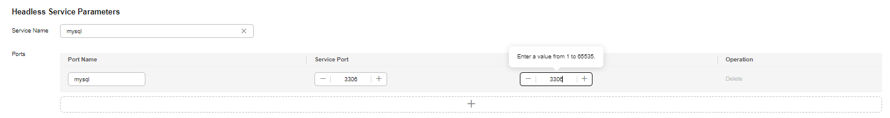
- Click Create  Workload

<h1>Create Deployment Apache-server Workload </h1>

- From Workloads go to Deployment and click Create Workload
  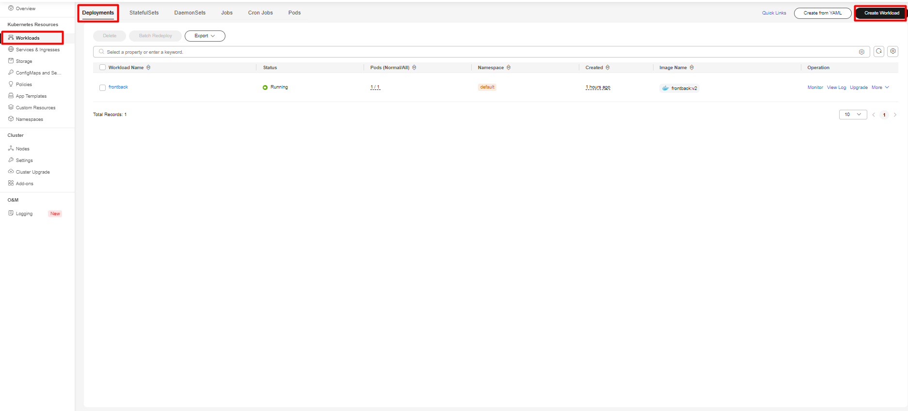
- choose pod number and be sure it is Deployment
- select your  images/image and version
  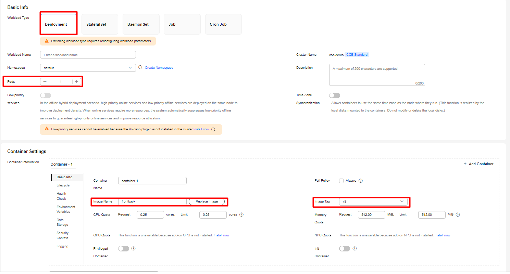
- Add the folowing environmental variables
  - password	my-secret-pw
  - servername	mysql
  - username	root
  - dbname	user_auth
    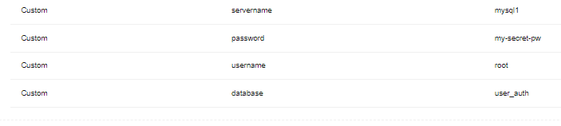
- Set the Loadbalancer Service Parameters auto create one and connect 80 service port to 80 container port
  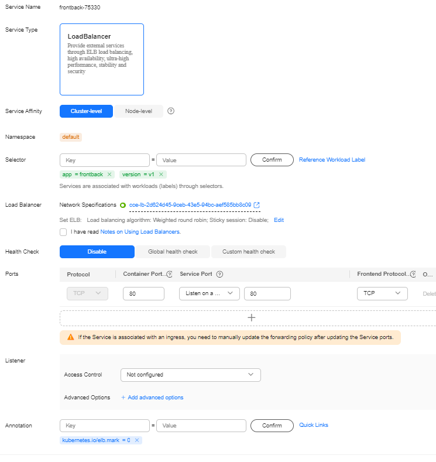
- Click Create  Workload


